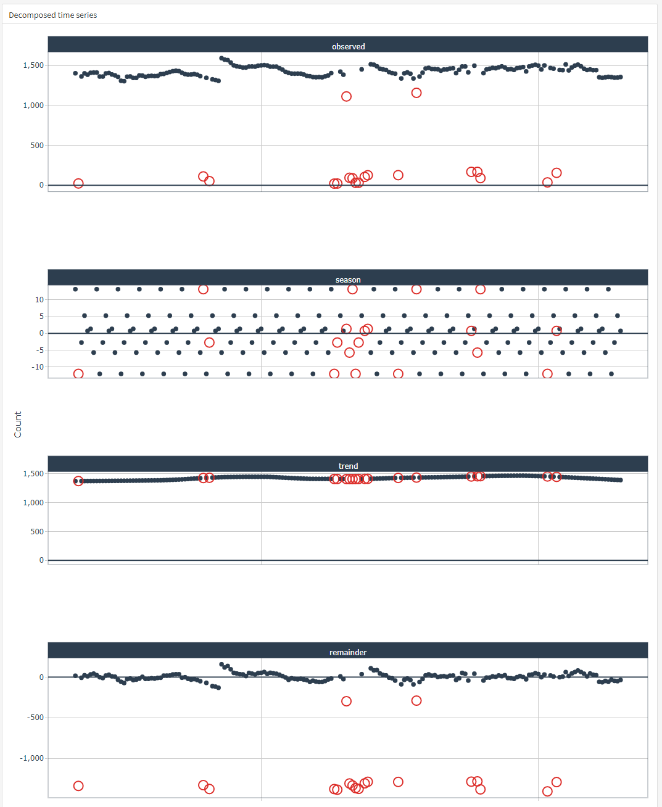

```{r setup, include=FALSE}
library(flexdashboard)
library(shiny)
library(shinyWidgets)
library(shinyjs)
library(data.table)
library(tidyverse)
library(tidyquant)
library(anomalize)
library(plotly)
library(tidyr)
library(tibble)
library(vctrs)
library(lubridate)
library(modeltime)
library(timetk)
library(tidymodels)
library(randomForest)
library(glmnet)
library(tinytex)
library(shinycssloaders)

```

<style>
div.blue { background-color:#e6f0ff; border-radius: 5px; padding: 20px;}
</style>

```{r}

product_purchases <- read.csv("product_purchase_overtime.csv")

first_purchase_date <- product_purchases %>%
  mutate(Date = as.Date(Date)) %>% 
  filter(purchase_count != 0) %>%
  arrange(products, Date) %>% 
  group_by(products) %>% 
  mutate(mindate = min(Date)) %>% 
  distinct(products, mindate) %>% 
  ungroup()

product_purchases <- product_purchases %>% 
  mutate(Date = as.Date(Date)) %>% 
  as_tibble() %>% 
  select(products, Date, purchase_count) %>% 
  left_join(first_purchase_date) %>% 
  filter(Date >= mindate) %>% 
  select(-mindate)

```


Sidebar {.sidebar}
=====================================

```{r}
# Inputs

selectizeInput(
    inputId = "input_product",
    label = h3("Select Your Product and click on Apply to get started"),
    choices = unique(product_purchases$products),
    selected = "Silent Canary alarm",
    multiple = TRUE,
    options = list(maxItems = 1)
)

hr()

actionButton(inputId = "apply", label = "Apply", icon = icon("play"))

hr()

dateRangeInput(
    inputId = "date_range",
    label = h3("Input Date Range"),
    start = min(product_purchases$Date),
    end = max(product_purchases$Date),
    min = min(product_purchases$Date),
    max = max(product_purchases$Date),
)

hr()

selectInput(
        inputId  = "input_alpha",
        label    = h3("Alpha (Sensitivity for IQR anomaly detection)"),
        choices  = seq(0.00, 1, by=0.01),
        multiple = FALSE,
        selected = 0.05
)


```


<hr>   

___Note: This report is based on fake data and fake company name. All product names are made up. Any resemblance to anything fictional or otherwise is purely coincidental___

<hr>

___Dashboard Author: Deepsha Menghani___       
Portfolio: https://deepshamenghani.quarto.pub/dmenghani/    
Github: https://github.com/deepshamenghani
LinkedIn: https://www.linkedin.com/in/deepshamenghani/   
Shiny Flexdashboard code: https://github.com/deepshamenghani/ShinyFlex_AnomaliesAndForecast

```{r}
products_distinct <- product_purchases %>% distinct(products)

products_count_filtered <- eventReactive(
  eventExpr = input$apply,

  valueExpr = {
      product_purchases %>%
          filter(products %in% input$input_product) %>% 
          filter(Date %>% between(left  = input$date_range[1],
                                           right = input$date_range[2]))
  },
  ignoreNULL = FALSE
)


product_decomposed_iqr <- eventReactive(
  eventExpr = input$apply,

  valueExpr = {
      products_count_filtered() %>%
            time_decompose(purchase_count, merge = TRUE) %>%
            anomalize(target = remainder,
                      method = "iqr", 
                      alpha  = as.double(input$input_alpha)) %>%
                      mutate(anomaly = ifelse(purchase_count <= 0, "Yes", anomaly)) %>%
                      group_by(products, group = cumsum(anomaly != lag(anomaly, default = first(anomaly)))) %>%
                      mutate(counter = row_number()) %>%
                      ungroup() %>%
                      select(-group) %>%
                      mutate(counter = as.double(counter)) %>%
                      time_recompose()  %>%
                      mutate(purchase_count_cleaned = ifelse(anomaly == "Yes", season + trend, observed))
  },
  ignoreNULL = FALSE
)

product_ts_tbl <- eventReactive(
  eventExpr = input$apply,

  valueExpr = {
      products_count_filtered() %>%
      select(Date, purchase_count ) %>%
      set_names(c("date", "value"))
  },
  ignoreNULL = FALSE
)
```

```{r}
calibration_forecast_tbl <- eventReactive(
  eventExpr = input$apply,

  valueExpr = {
      splits <- product_ts_tbl() %>%
      time_series_split(assess = "1 month", cumulative = TRUE)
    
    model_fit_prophet <- prophet_reg() %>%
      set_engine("prophet", yearly.seasonality = FALSE) %>%
      fit(value ~ date, training(splits))
    
    model_fit_prophet %>%
      modeltime_calibrate(testing(splits))
  },
  ignoreNULL = FALSE
)


```


Product Sales
=====================================

Column {data-width=350}
-----------------------

### ___About this Dashboard___

<div class = "blue">   

> This dashboard looks at data from _EverythingYouWillNeed.com_ website to report out on daily product sales. You can select the product, the dates to analyze and click on apply to replicate the report for the specific product choice and time period.

 - Forecast tab: This plot helps the stakeholders forecast product sales in upcoming month.
 - Anomalies tab: This plot checks for anomalies so any upstream data issues can be reported. You can change alpha to increase or decrease the threshold of what is considered anomalous data.
 - Download tables: All the tables in this dashboard can be copied or downloaded to share with stakeholders including sales and forecast.

</div>
<br>

### Products Purchase table filtered

```{r}
DT::renderDataTable(products_count_filtered() %>% arrange(desc(Date)),
                          extensions = 'Buttons',
                          options = list(
                                scrollX = TRUE,
                                scrollY = "250px",
                                pageLength = 100,
                                dom = 'tB',
                                buttons = c('copy', 'csv', 'excel')
                            )
  )
```


### Total purchase count for filtered data

```{r}

renderValueBox({
  valueBox(
    value   = products_count_filtered() %>%
      summarize(total_purchase = scales::number(sum(purchase_count, na.rm=TRUE), big.mark=",")) %>% 
      pull(total_purchase),
    caption = "Total product sales",
    icon    ="fa-heartbeat",
    color   = "info"
    )
})


```


### Avgerage weekly purchase 

```{r}

renderValueBox({

  valueBox(
    value   = products_count_filtered() %>% 
  mutate(weeklydate = FLOOR_WEEK(Date)) %>% 
  group_by(products, weeklydate) %>%
  summarise(weeklypurchase = sum(purchase_count, na.rm=TRUE)) %>% 
  ungroup() %>% 
  summarise(scales::number(mean(weeklypurchase, na.rm=TRUE), big.mark=",")) %>% 
  pull(),
    caption = "Avg weekly sales",
    icon    =  "fa-money-check-alt",
    color   = "#0078D4"
    )

})

```


Column
-----------------------

### Sales Data for the selected product

```{r}

output$products_ts <- renderPlotly({
    g <- product_ts_tbl() %>%
      plot_time_series(date, value, .interactive = TRUE, .smooth = FALSE, .title = str_glue("Sales over time for {input$input_product}"))
    ggplotly(g)
    
})

plotlyOutput(outputId = "products_ts")

```


Forecast Sales {data-orientation=rows}
=====================================

Row {data-height=980}
-------------------------------------


### Forecast plot

```{r eval=TRUE}

output$product_forecast_plot <- renderPlotly({
    showModal(modalDialog("Calculating forecast", footer=NULL))
    g <- calibration_forecast_tbl() %>%
    modeltime_refit(product_ts_tbl() %>% filter(value !=0)) %>%
      modeltime_forecast(h = "1 month", actual_data = product_ts_tbl()) %>%
      plot_modeltime_forecast(.interactive = TRUE, .conf_interval_show = TRUE, .smooth = FALSE, .legend_show = TRUE, .color_lab = "Forcast method")
  removeModal()
  ggplotly(g)
})

plotlyOutput(outputId = "product_forecast_plot")

```


Row 
-------------------------------------

### Forecast output

```{r eval=TRUE}

DT::renderDataTable(as.data.frame(calibration_forecast_tbl() %>%
    modeltime_refit(product_ts_tbl() %>% filter(value !=0)) %>%
      modeltime_forecast(h = "1 month", actual_data = product_ts_tbl()) %>% 
      arrange(desc(.index))),
                          extensions = 'Buttons',
                          options = list(
                                scrollX = TRUE,
                                scrollY = "250px",
                                pageLength = 100,
                                dom = 'tB',
                                buttons = c('copy', 'csv', 'excel')
                            )
  )

```

Anomaly Detection {data-orientation=columns}
=====================================

Columns
-----------------------

### Anomalies plot

> Change alpha on the sidebar and click on _"Apply"_ to increase or decrease the threshold of what is considered anomalous data

```{r}
output$product_anomalies <- renderPlotly({
    showModal(modalDialog("Calculating anomalies", footer=NULL))
    g <- product_decomposed_iqr() %>%
            plot_anomalies(time_recomposed = TRUE) +
            expand_limits(y = 0) +
            scale_y_continuous(labels = scales::number_format(big.mark = ",")) +
            labs(x = "", y = "Count") +
            geom_line(aes(Date, purchase_count), color = "darkgreen") +
            expand_limits(y = 0) +
            scale_y_continuous(labels = scales::number_format(big.mark = ","))  +
            theme_tq() + theme(legend.position = "none") +
            theme(
              axis.text.x = element_blank()
            )
  removeModal()
  ggplotly(g)
})

plotlyOutput(outputId = "product_anomalies") 
```


About this dashboard
=====================================

Column
-----------------------

### ___About Anomalies tab___

<div class = "blue">   

> The Anomaly tab checks for anomalies to detect any upstream data issues or red signals in sales so the relevant business action can be taken. 
You can change alpha on the sidebar to increase or decrease the threshold of what is considered anomalous data.    
<br>   
__About "Anomalize"__: The anomalize package helps decompose the time series into seasonality, trend and remainder as shown in the image to the right. The anomalies are then calculated on the remainder. In this dashboard I am using the Inter Quartile Range (IQR) method to detect anomalies. 

</div>
<br>

### ___About Forecasts tab___

<div class = "blue">   

> The Forecast tab checks for seasonality and trend to forecast product sales. 
The tabular form of the predicted sales can be copied or downloaded to share with stakeholders.    
<br> 
The forecasts were calculated using [modeltime](https://www.rdocumentation.org/packages/modeltime/versions/1.2.2) and [parsnip](https://www.rdocumentation.org/packages/parsnip/versions/1.0.2) packages that can be used to plot and compare various forecast methods. In this case "Prophet" was used to calculate 1 month forecast.

</div>
<br>

### ___Code___

<div class = "blue">   

> You can find the code to reproduce this report at the [github repository](https://github.com/deepshamenghani/ShinyFlex_AnomaliesAndForecast).

</div>
<br>


Column
-----------------------

```{r eval=FALSE}
output$decomposed_product_anomalies <- renderPlotly({

    g <- product_decomposed_iqr() %>%
            plot_anomaly_decomposition() +
            expand_limits(y = 0) +
            scale_y_continuous(labels = scales::number_format(big.mark = ",")) +
            labs(x = "", y = "Count") +
            theme_tq() + theme(legend.position = "none") +
            theme(
              axis.text.x = element_blank()
            ) #+
            #scale_x_date(labels = product_dates())

  ggplotly(g)
})

plotlyOutput(outputId = "decomposed_product_anomalies")
```

{width=100%}